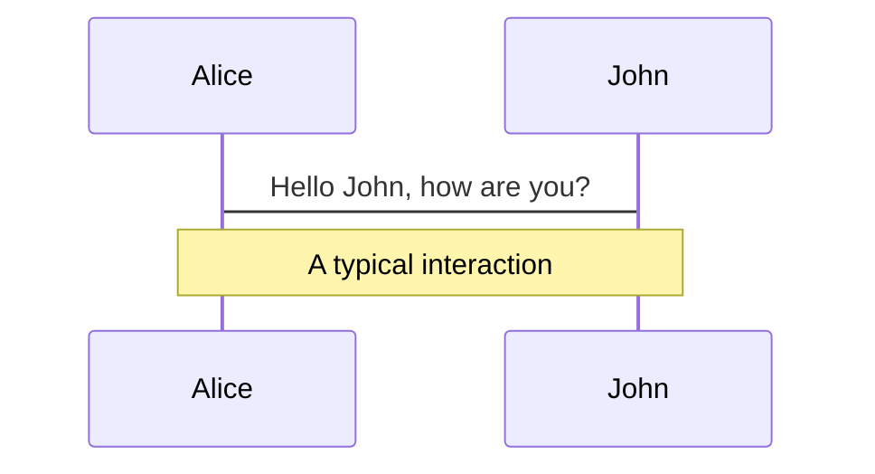
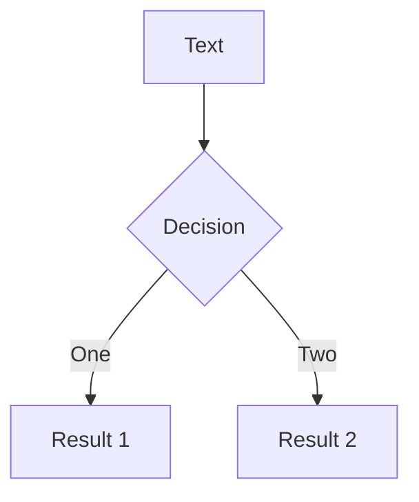
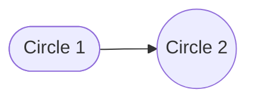

# Neversink

A [Slidev](https://sli.dev) theme designed by **Todd Gureckis**   
<div class="iconlink">

_New York University_ <a href="https://todd.gureckislab.org" class="iconlink"><mdi-open-in-new /></a>  
</div>


---
layout: side-title
color: amber
align : rm-lm
---

:: title ::

# Slidev Neversink Theme

:: content ::

Neversink is theme for education and academic presentations.  It is designed to be bright, flat, minimal, and easy to read.  It is based on the default Slidev theme but with some additional features and color schemes that have reference in the [metropolis](https://github.com/matze/mtheme) Beamer theme among others.

It is named for the [Neversink River](https://en.wikipedia.org/wiki/Neversink_River) for absolutely no discernable reason.

---
layout: default
---

# Why use it?


- Neversink has several configurable ==layouts== that build upon the Slidev defaults and which make it easier to quickly throw together common slide layouts without having to write a lot of custom CSS/HTML.

- It has a variety of ==color themes== to choose from that make your visual identity more coherent. 


- It also has some whimsical elements like movie-style scrolling credits, animated speech bubbles, and admonitions that make your presentations more memorable.

- It strives to be well documented and easy to use! 


 You can find the source code on [GitHub](http://github.com/gureckis/slidev-theme-neversink).

---
layout: default
---

# How to install


The theme depends on Slidev.  So you need to have that [installed first](https://sli.dev/guide/install).  Then you can install the theme with npm:

```bash
npm install slidev-theme-neversink
```

Then create a slidev markdown file (e.g., `slides.md`) and add the theme to the frontmatter of your first slide:

```md
---
theme: neversink
---
```

Then you are basically ready to go!


---
layout: default
---

# Color schemes


Let's start with colors.  

The project uses tailwind-like color schemes arranged in ==monochromatic pairs==. These boxes show the options and names:

**B&W**:

<span class="text-white bg-black p-1 pl-3 pr-3 m-1 rounded font-size-3">black</span>
<span class="text-black bg-white border-1 border-solid border-black p1 pl-3 pr-3 m-1 rounded font-size-3">white</span>
<span class="text-gray-100 bg-gray-800 p1 pl-3 pr-3 m-1 rounded font-size-3">dark</span>
<span class="text-gray-800 bg-gray-100 p1 pl-3 pr-3 m-1 rounded font-size-3">light</span>

**Light**:

<span class="bg-slate-100 text-slate-500 p1 pl-3 pr-3 m-1 rounded font-size-3">slate-light</span>
<span class="bg-gray-100 text-gray-500 p1 pl-3 pr-3 m-1 rounded font-size-3">gray-light</span>
<span class="bg-zinc-100 text-zinc-500 p1 pl-3 pr-3 m-1 rounded font-size-3">zinc-light</span>
<span class="bg-neutral-100 text-neutral-500 p1 pl-3 pr-3 m-1 rounded font-size-3">neutral-light</span>
<span class="bg-stone-100 text-stone-500 p1 pl-3 pr-3 m-1 rounded font-size-3">stone-light</span>
<span class="bg-red-100 text-red-500 p1 pl-3 pr-3 m-1 rounded font-size-3">red-light</span>
<span class="bg-orange-100 text-orange-500 p1 pl-3 pr-3 m-1 rounded font-size-3">orange-light</span>
<span class="bg-amber-100 text-amber-500 p1 pl-3 pr-3 m-1 rounded font-size-3">amber-light</span>
<span class="bg-yellow-100 text-yellow-500 p1 pl-3 pr-3 m-1 rounded font-size-3">yellow-light</span><br />
<span class="bg-lime-100 text-lime-500 p1 pl-3 pr-3 m-1 rounded font-size-3">lime-light</span>
<span class="bg-green-100 text-green-500 p1 pl-3 pr-3 m-1 rounded font-size-3">green-light</span>
<span class="bg-emerald-100 text-emerald-500 p1 pl-3 pr-3 m-1 rounded font-size-3">emerald-light</span>
<span class="bg-teal-100 text-teal-500 p1 pl-3 pr-3 m-1 rounded font-size-3">teal-light</span>
<span class="bg-cyan-100 text-cyan-500 p1 pl-3 pr-3 m-1 rounded font-size-3">cyan-light</span>
<span class="bg-sky-100 text-sky-500 p1 pl-3 pr-3 m-1 rounded font-size-3">sky-light</span>
<span class="bg-blue-100 text-blue-500 p1 pl-3 pr-3 m-1 rounded font-size-3">blue-light</span>
<span class="bg-indigo-100 text-indigo-500 p1 pl-3 pr-3 m-1 rounded font-size-3">indigo-light</span>
<span class="bg-violet-100 text-violet-500 p1 pl-3 pr-3 m-1 rounded font-size-3">violet-light</span><br />
<span class="bg-purple-100 text-purple-500 p1 pl-3 pr-3 m-1 rounded font-size-3">purple-light</span>
<span class="bg-pink-100 text-pink-500 p1 pl-3 pr-3 m-1 rounded font-size-3">pink-light</span>
<span class="bg-rose-100 text-rose-500 p1 pl-3 pr-3 m-1 rounded font-size-3">rose-light</span>
<span class="bg-fuchsia-100 text-fuchsia-500 p1 pl-3 pr-3 m-1 rounded font-size-3">fuchsia-light</span>
<span class="bg-gray-50 text-navy-900 p1 pl-3 pr-3 m-1 rounded font-size-3">navy-light</span>

**Regular**:

<span class="bg-slate-500 text-slate-100 p1 pl-3 pr-3 m-1 rounded font-size-3">slate</span>
<span class="bg-gray-500 text-gray-100 p1 pl-3 pr-3 m-1 rounded font-size-3">gray</span>
<span class="bg-zinc-500 text-zinc-100 p1 pl-3 pr-3 m-1 rounded font-size-3">zinc</span>
<span class="bg-neutral-500 text-neutral-100 p1 pl-3 pr-3 m-1 rounded font-size-3">neutral</span>
<span class="bg-stone-500 text-stone-100 p1 pl-3 pr-3 m-1 rounded font-size-3">stone</span>
<span class="bg-red-500 text-red-100 p1 pl-3 pr-3 m-1 rounded font-size-3">red</span>
<span class="bg-orange-500 text-orange-100 p1 pl-3 pr-3 m-1 rounded  font-size-3">orange</span>
<span class="bg-amber-500 text-amber-100 p1 pl-3 pr-3 m-1 rounded font-size-3">amber</span>
<span class="bg-yellow-500 text-yellow-100 p1 pl-3 pr-3 m-1 rounded font-size-3">yellow</span>
<span class="bg-lime-500 text-lime-100 p1 pl-3 pr-3 m-1 rounded font-size-3">lime</span>
<span class="bg-green-500 text-green-100 p1 pl-3 pr-3 m-1 rounded font-size-3">green</span>
<span class="bg-emerald-500 text-emerald-100 p1 pl-3 pr-3 m-1 rounded font-size-3">emerald</span>
<span class="bg-teal-500 text-teal-100 p1 pl-3 pr-3 m-1 rounded font-size-3">teal</span>
<span class="bg-cyan-500 text-cyan-100 p1 pl-3 pr-3 m-1 rounded font-size-3">cyan</span><br/>
<span class="text-gray-300 bg-navy-900 p1 pl-3 pr-3 m-1 rounded font-size-3">navy</span>
<span class="bg-sky-500 text-sky-100 p1 pl-3 pr-3 m-1 rounded font-size-3">sky</span>
<span class="bg-blue-500 text-blue-100 p1 pl-3 pr-3 m-1 rounded font-size-3">blue</span>
<span class="bg-indigo-500 text-indigo-100 p1 pl-3 pr-3 m-1 rounded font-size-3">indigo</span>
<span class="bg-violet-500 text-violet-100 p1 pl-3 pr-3 m-1 rounded font-size-3">violet</span>
<span class="bg-purple-500 text-purple-100 p1 pl-3 pr-3 m-1 rounded font-size-3">purple</span>
<span class="bg-pink-500 text-pink-100 p1 pl-3 pr-3 m-1 rounded font-size-3">pink</span>
<span class="bg-rose-500 text-rose-100 p1 pl-3 pr-3 m-1 rounded font-size-3">rose</span>
<span class="bg-fuchsia-500 text-fuchsia-100 p1 pl-3 pr-3 m-1 rounded font-size-3">fuchsia</span>


---
layout: default
---

# Color schemes

In many parts of the theme you can use the color schemes to help choose matching colors for your slides.  For example, we can make a slide with a sticky note using the `rose-light` color scheme, the `sky` color scheme, or the `amber-light` color scheme:

<StickyNote color="rose-light" textAlign="left" width="180px" v-drag="[122,253,180,180,-14]">

Hello, I'm a **redish sticky note** using `rose-light`.
</StickyNote>

<StickyNote color="sky" textAlign="left" width="180px"  v-drag="[389,251,180,180,9]">

Hello, I'm a **blueish sticky note** using `sky`.
</StickyNote>


<StickyNote color="amber-light" textAlign="left" width="180px"  v-drag="[650,253,180,180,-9]">

Hello, I'm a **yellowish sticky note** using `amber-light`.
</StickyNote>


---
layout: side-title
color: emerald-light
align: rm-lm
titlewidth: is-3
---

<StickyNote color="emerald-light" textAlign="left" width="180px"  v-drag="[719,291,180,180,16]">

Don't worry if you don't understand all the details, yet we are still talking about **color schemes**.
</StickyNote>


:: title ::
# Color schemes


:: content ::

Or we can use the `emerald-light` scheme in a slide layout to set the overall color and style of a slide with a matching sticky note:

```md
---
layout: side-title
color: emerald-light
align: rm-lm
titlewidth: is-3
---
```

---
layout: top-title
color: amber
align: l
---

:: title ::
# Layouts

:: content ::

The theme includes many layouts. Layouts set the overall structure of the page.  For example, this slide is using the `top-title` layout with the `amber` color scheme.  You can see the frontmatter for this slide below:

```md
---
layout: top-title
color: amber
align: l
---
```

The previous slide used the `side-title` layout with the `emerald-light` color scheme.  You can see the frontmatter for that slide below:

```md
---
layout: side-title
color: emerald-light
align: rm-lm
titlewidth: is-3
---
```


---
layout: top-title-two-cols
color: amber-light
align: l-lt-lt
---

:: title ::

# Two things about layouts


:: left ::

There are two important parts of slides to know about.

## Frontmatter 

First is **frontmatter**, which are configuration options
that appear at the start of each slide (see [Slidev docs](https://sli.dev/guide/syntax#frontmatter-layouts)).  These configure things like
alignment, color, and spacing:

```md
---
layout: top-title
color: sky
align: l
---
```

:: right ::

# Slots 

The other aspect is **slots**.  Slots are a basic part of [Vue.js](https://vuejs.org/guide/components/slots.html).  In Slidev slots can be marked using `:: slotname ::` and then filled in with content.  For example, the `:: left ::` and `:: right ::` slots on this slide are filled with content.

Slots effectively help you map parts of your slide to different parts of a layout.  The most common case is to say which content appears in the left column and which appears in the right column. But different layouts can have different slots and different content.


---
layout: top-title
color: amber-light
align: lt
---

:: title ::

# Available Layouts

:: content ::

The available layouts in **Neversink** currently are:  


<div class="tight">

<div class='flex flex-wrap'>

<div class='w-1/3'>

- `cover`
- `intro`
- `default`
- `section`
- `quote`
- `full`
- `credits`
</div>

<div class='w-1/3'>


- `two-cols-title`
- `top-title`
- `top-title-two-cols`
- `side-title`

</div>

<div class='w-1/3'>

- `image-right`
- `image-left`
- `image`
- `iframe-right`
- `iframe-left`
- `iframe`
- `none`
- `end`
- `fact` 

</div>
</div>
</div>


We will step through these one by one showing several examples
and how to configure the frontmatter for each.


---
layout: cover
---

# This is the `cover` layout

**Todd Gureckis**   
<div class="iconlink">

_New York University_ <a href="https://todd.gureckislab.org" class="iconlink"><mdi-open-in-new /></a>  
</div>

:: note ::

<div class="fw-200" >

\* Optional `:: note ::` slot for mentioning ==notes== at the bottom.

</div>


---
layout: cover
color: dark
---

# This is the `cover` layout

**Todd Gureckis**   
<div class="iconlink">

_New York University_ <a href="https://todd.gureckislab.org" class="iconlink"><mdi-open-in-new /></a>  
</div>

:: note ::

<div class="fw-200" >

\* Here we set `color: dark` in the frontmatter.

</div>


---
layout: cover
color: amber
---

# This is the `cover` layout

**Todd Gureckis**   
<div class="iconlink">

_New York University_ <a href="https://todd.gureckislab.org" class="iconlink"><mdi-open-in-new /></a>  
</div>

:: note ::

<div class="fw-200" >

\* Here we set `color: amber` in the frontmatter.

</div>


---
layout: cover
color: amber-light
---

# This is the `cover` layout

**Todd Gureckis**   
<div class="iconlink">

_New York University_ <a href="https://todd.gureckislab.org" class="iconlink"><mdi-open-in-new /></a>  
</div>

:: note ::

<div class="fw-200" >

\* Here we set `color: amber-light` in the frontmatter.  Notice how the color scheme brings along many of the elements on the page.

</div>


---
layout: cover
color: pink
---

### This is the `cover` layout with a longer title for your talk you just use more `#`s

**Todd Gureckis**   
<div class="iconlink">

_New York University_ <a href="https://todd.gureckislab.org" class="iconlink"><mdi-open-in-new /></a>  
</div>

:: note ::

<div class="fw-200" >

\* Here we set `color: pink` in the frontmatter.  Different choices convey a different vibe for the intro of your talk.  There's lots of choices available.

</div>


---
layout: intro
color: emerald-light
---

# This is the `intro` layout

**Todd Gureckis**   
<div class="iconlink">

_New York University_ <a href="https://todd.gureckislab.org" class="iconlink"><mdi-open-in-new /></a>  
</div>

<br />

This is like the cover slide but with a little less decoration.
It also has a frontmatter option of `color: emerald-light`.

---
layout: default
---

# This is the `default` layout

This is kind of the basic slide.  The main content is interpreted as markdown and rendered in the center of the slide.  

Speaking of markdown, you can use markdown to make things **bold** or *italic* or even `code` like `this`.  In **Neversink** you can also ==highlight things using the double equals signs like this==
thanks to the `markdown-it-mark` plugin.

Of course you can make bullet lists:

- Hi
- There

Also there's a little helper class you can add to make the bullet spacing a bit tighter:

<div class="tight">

- Hi
- There
- I need space
</div>


---
layout: default
color: sky
---

# The `default` layout 

The default layout also has an optional `color` option in the frontmatter.
For example this is

```md
---
layout: default
color: sky
---
```


---
layout: default
color: light
---

# The `default` layout 

Things don't have to be so dramatic.  For more conservative presentations you can use color schemes like `light`:

```md
---
layout: default
color: light
---
```

And of course you don't have to change the color scheme every slide! 


---
layout: section
---

# The `section` layout

This is a section slide.  It can be use to make a noticable point or break between sections.


---
layout: section
color: navy
---

# The `section` layout
<hr>
It has a `hr` which is color matched to the color scheme.  For example, this slide is using the `navy` color scheme and the line is white.


---
layout: section
color: indigo
---

# The `section` layout
<hr>

This is `color: indigo` and the line and font is a light indigo shade.


---
layout: section
color: navy
---

<div class="w-1/2 ml-30">

# The `section` layout
<hr>

<span class='text-amber-300'>
You can use HTML and inline CSS to modify the look and feel.
</span>

</div>

---
layout: quote
color: sky-light
quote: "This is a quote slide.  It has a frontmatter option of `quote` which is the text that appears in the quote box and `author` and options for the size of the text(`quotesize: text2xl` and `authorsize: text-l`).  I feel it is a little uninspired but might save you some time."
author: "Todd Gureckis"
---


---
layout: quote
color: amber-light
---


---
layout: full
title: Full Layout
---

<div class='border-1px v-full h-full p-5'>

This is `layout: full` which fills the whole screen for the most part.
The grey box is just showing you the full addressable space.
Full can be useful for arbitrary layouts such as on the next slide which uses
the `v-drag` directive to position elements.

</div>

---
layout: full
title: Full with Arbitrary Layout
---

<div class='v-full h-full'>

<SpeechBubble position="l" shape="round"  color='pink-light' v-drag="[555,342,274,58]">

Hello, I'm an **ice cream**!
</SpeechBubble>

<SpeechBubble position="bl" shape="round"  color='emerald-light' v-drag="[445,258,274,57]">

Hello, I'm **kawaii**.
</SpeechBubble>

<SpeechBubble position="r" shape="round" animation="float"  color='sky' v-drag="[143,391,274,84]">

I'm v-dragged out and ==floating==.
</SpeechBubble>

<IceCream :size="150" mood="lovestruck" color="#FDA7DC" v-drag="[439,341,85,150]" />

<div class="tight" v-drag="[143,33,277,214]">

<span class="bg-red-100 text-red-600 p-2 border-l-6 border-2 border-red-200 rounded-lg pl-4 pr-4">Here's a list of somethings</span>

- Novelty bonuses
- Cumulative prediction error
- Learning progress
- Surprise
- Suspense
- Information gain

</div>

<div class="tight" v-drag="[461,63,293,148,17]">

<span class="bg-emerald-100 text-emerald-500 p-2 border-l-6 border-2 border-emerald-200 rounded-lg pl-4 pr-4">Here's another list of things</span>

- Structured behaviors
- Compositional
- Communicable

</div>

</div>


---
layout: full
title: Full Layout - 2 Col Fig
---

This is an example of using unocss atomic classes to put two figures side by side.

<div class="grid w-full h-fit grid-cols-2 grid-rows-2 mt-10 mb-auto">
<div class="grid-item grid-col-span-1"></div>
<div class="grid-item grid-col-span-1"></div>
<div class="grid-item grid-col-span-2 text-center h-fit">

**Figure show this**: this is a two column figure

</div>
</div>

---
layout: full
title: Full Layout - 3 Col Fig
---

This is an example of using unocss atomic classes to put three figures side by side.

<div class="grid w-full h-fit grid-cols-3 grid-rows-2 mt-20 mb-auto">
<div class="grid-item grid-col-span-1"></div>
<div class="grid-item grid-col-span-1"></div>
<div class="grid-item grid-col-span-1"></div>
<div class="grid-item grid-col-span-3 text-center h-fit">

**Figure show this**: this is a three column figure

</div>

</div>


---
layout: credits
color: light
---

<div class="grid text-size-4 grid-cols-3 w-3/4 gap-y-10 auto-rows-min ml-auto mr-auto">
<div class="grid-item text-center mr-0- col-span-3">
  
  This is the `layout: credits` slide.  It's a movie-like scrolling credits!
</div>
<div class="grid-item text-center mr-0- col-span-3">
  <strong>Cast</strong><br> 
  <span class="font-size-3 mt-0">(In order of appearance)</span>
</div>
<div class="grid-item text-right mr-4 col-span-1"><strong>Study 1</strong></div>
<div class="grid-item col-span-2">Person 1 <i>as PhD student</i>&nbsp;<mdi-open-in-new class="font-size-3 mb-0.5" /><br/>Person 2 <i>as Co-PI</i>&nbsp;<mdi-open-in-new class="font-size-3 mb-0.5" /></div>
<div class="grid-item text-right mr-4 col-span-1"><strong>Study 2</strong></div>
<div class="grid-item col-span-2">Person 3 <i>as Postdoc</i>&nbsp;<mdi-open-in-new class="font-size-3 mb-0.5" /><br/>Person 4 <i>as Co-PI</i>&nbsp;<mdi-open-in-new class="font-size-3 mb-0.5" /></div>
<div class="grid-item text-right mr-4 col-span-1"><strong>Experiments</strong></div>
<div class="grid-item col-span-2">Smile 🫠</div>
<div class="grid-item text-right mr-4 col-span-1"><strong>Funding</strong></div>
<div class="grid-item col-span-2">National Science Foundation<br/>
National Institute of Health</div>
<div class="grid-item text-right mr-4 col-span-1"><strong>Slides</strong></div>
<div class="grid-item col-span-2">
Slidev<br/>
Unocss<br/>
Figma<br/>
Vuejs<br/>
Vite<br/>
</div>
<div class="grid-item col-span-3 text-center mt-180px mb-auto font-size-1.5rem"><strong>Questions?</strong></div>
</div>


---
layout: credits
color: navy
speed: 4.0
loop: true
---

<div class="grid text-size-4 grid-cols-3 w-3/4 gap-y-10 auto-rows-min ml-auto mr-auto">
<div class="grid-item text-center mr-0- col-span-3">
  
  This one has `speed: 4.0` and `loop: true` in the front matter
</div>
<div class="grid-item text-center mr-0- col-span-3">
  <strong>Cast</strong><br> 
  <span class="font-size-3 mt-0">(In order of appearance)</span>
</div>
<div class="grid-item text-right mr-4 col-span-1"><strong>Study 1</strong></div>
<div class="grid-item col-span-2">Person 1 <i>as PhD student</i>&nbsp;<mdi-open-in-new class="font-size-3 mb-0.5" /><br/>Person 2 <i>as Co-PI</i>&nbsp;<mdi-open-in-new class="font-size-3 mb-0.5" /></div>
<div class="grid-item text-right mr-4 col-span-1"><strong>Study 2</strong></div>
<div class="grid-item col-span-2">Person 3 <i>as Postdoc</i>&nbsp;<mdi-open-in-new class="font-size-3 mb-0.5" /><br/>Person 4 <i>as Co-PI</i>&nbsp;<mdi-open-in-new class="font-size-3 mb-0.5" /></div>
<div class="grid-item text-right mr-4 col-span-1"><strong>Experiments</strong></div>
<div class="grid-item col-span-2">Smile 🫠</div>
<div class="grid-item text-right mr-4 col-span-1"><strong>Funding</strong></div>
<div class="grid-item col-span-2">National Science Foundation<br/>
National Institute of Health</div>
<div class="grid-item text-right mr-4 col-span-1"><strong>Slides</strong></div>
<div class="grid-item col-span-2">
Slidev<br/>
Unocss<br/>
Figma<br/>
Vuejs<br/>
Vite<br/>
</div>
<div class="grid-item col-span-3 text-center mt-180px mb-auto font-size-1.5rem"><strong>Questions?</strong></div>
</div>


---
layout: image-left
image: /images/photo.png
class: mycoolclass
---

<br />

# Image left

This is the `layout: image-left` layout.

---
layout: image-right
image: /images/photo2.png
slide_info: false
class: mycoolclass
---

# Image right

This is the `layout: image-right` layout.

---
layout: image
image: /images/photo.png
title: Image Layout
---

---
layout: iframe-left
title: iframe Left Layout
# the web page source
url: https://gureckislab.org

# a custom class name to the content
class: my-cool-content-on-the-right
---

<br />

# This is a website on the left

This is useful for showing a website but loads live on the web so requires and internet connection.

---
layout: iframe-right
title: iframe Right Layout
# the web page source
url: https://gureckislab.org

# a custom class name to the content
class: my-cool-content-on-the-right
slide_info: false
---

# This is a website on the right

This is useful for showing a website but loads live on the web so requires and internet connection.

---
layout: iframe
title: iframe Layout
# the web page source
url: https://gureckislab.org
slide_info: false
---


---
layout: two-cols-title
columns: is-6
align: l-lt-lt
title: Two Cols Header (Info)
---

:: title ::

# `two-cols-title`

:: left ::

This is `layout: two-cols-title`. 

- There are three slots: `:: title ::`, `:: left ::`, and `:: right ::` along with the default which is implicit before any named slots.

- It additionally provides three configuration options in the slide YAML front matter:
  `color`, `columns` and `align`.

:: right ::

- `color` is the color scheme.

- `columns` is the relative spacing given to the left versus right column. The overall space is divided into 12 columns. Instructions like `is-5` will give 5 units to the left and 7 to the right.

- The <code>align</code> parameter determines how the columns look. The notation is for example
  <code>align: l-cm-cm</code>. The first part is for the header, the second for the left column, the third part is for the right column. The first letter is (<code>c</code> for center, <code>l</code> for left, <code>r</code> for right), the second letter
  is vertical alignment (<code>t</code> for top, <code>m</code> for middle, <code>b</code> for bottom). Only c/l/r works for the header.


---
layout: two-cols-title
columns: is-2
align: l-lt-lt
title: Two Cols Header (Info)
---

:: left ::

# This is `layout: two-cols`. 

:: right ::


- There are two slots: `:: left ::`, and `:: right ::`.

- It additionally provides two configuration options in the slide YAML front matter:
  `columns` and `align`.

- `columns` is the relative spacing given to the left versus right column. The overall space is divided into 12 columns. Instructions like `is-5` will give 5 columns to the left and 7 to the right.

- The <code>align</code> parameter determines how the columns look. The notation is for example
  <code>align: cm-cm</code>. The first part is the left column, the second part is for the right column. The first letter is (<code>c</code> for center, <code>l</code> for left, <code>r</code> for right), the second letter
  is vertical alignment (<code>t</code> for top, <code>m</code> for middle, <code>b</code> for bottom). 

---
layout: side-title
side: l
color: violet
titlewidth: is-4
align: rm-lm
title: Side Title Layout (Another)
---

:: title ::

# `side-title`

# <mdi-arrow-right />

:: content ::

This is `layout: side-title` with `side: right` in the front matter.

```yaml
side: left
color: violet
titlewidth: is-4
align: rm-lm
```


---
layout: side-title
side: r
color: pink-light
titlewidth: is-6
align: lm-lb
title: Side Title Layout (Another)
---

:: title ::
 
# `side-title`

# <mdi-arrow-right />

:: content ::

This is `layout: side-title` with `side: right` in the front matter.

```yaml
side: right
color: pink-light
titlewidth: is-6
align: lm-lb
```


---
layout: top-title
color: violet
align: l
title: Top Title (Another)
---

:: title ::

# `top-title`: A variation with different parameters

:: content ::

Todd has used this navy color on many projects in the past. This is a top title layout.

I sort of like the `###` font style the best.

```yaml
layout: top-title
color: violet
titlewidth: is-2
align: lm
```

---
layout: top-title-two-cols
color: navy
columns: is-6
align: l-lt-lt
title: Top Title (Another)
---


:: title ::

### `top-title-two-cols`: A variation with two columns

:: left ::

- This is the left column
- This is a nice way to add color and distinction to a slide
- Options are `columns` which is the size of the left column, `color` (default `light`), and `align` which is the alignment of the title and columns (e.g., `l-lt-lt`)

:: right ::

- This is the right column
- This is a nice way to add color and distinction to a slide


---
layout: default
---

# Extras

In addition to these custom layouts, the **Neversink** theme includes a few custom components that can be used in your slides. These include sticky notes, speech bubbles, cute icons, QR codes, and more.  The next few slides walks through them:

<div class="tight">

- admonitions
- sticky notes
- speech bubbles
- cute icons
- QR codes
</div>


---
layout: two-cols-title
columns: is-6
title: Admonitions
dragPos:
  admon: Left,Top,Width,Height,Rotate
  "'admon'": 55,300,287,106
---

<Admonition title="V-draggable" color='teal-light' width="300px" v-drag="[93,303,300,145,-14]">
If you want to `v-drag` an admonition, you should set the width to a fixed value.
</Admonition>

:: title ::

# Admonitions

:: left ::

- Admonitions are boxes that you can use to call out things.

<Admonition title="Custom title" color='amber-light'>
This is my admon message
</Admonition>

:: right ::

<AdmonitionType type='note' >
This is note text
</AdmonitionType>

<!--
> [!note]
> This is note text
-->

<AdmonitionType type='important' >
This is important text
</AdmonitionType>

<AdmonitionType type='tip' >
This is a tip
</AdmonitionType>

<AdmonitionType type='warning' >
This is a tip
</AdmonitionType>

<AdmonitionType type='caution' >
This is warning text
</AdmonitionType>

---
layout: two-cols-title
columns: is-6
title: Bubbles
---

<SpeechBubble position="l" color='sky' shape="round"  v-drag="[83,364,274,109]">

Hello, I'm a **speech bubble**! I'm a longer speech bubble. I'm still going.
</SpeechBubble>

:: title ::

# Bubbles

:: left ::

- Bubbles are moveable elements that act as speech bubbles
- They can be configured for where you want the arrow to point
- The can be move around if you enable `v-drag` on the element

:: right ::

<SpeechBubble position="bl" color='amber-light' shape="round">

Hello, I'm a **speech bubble**! I'm a longer speech bubble. I'm still going.
Hello, I'm a **speech bubble**! I'm a longer speech bubble. I'm still going.
Hello, I'm a **speech bubble**! I'm a longer speech bubble. I'm still going.
</SpeechBubble>

---
layout: default
title: Sticky Notes
---

<StickyNote color="amber-light" textAlign="left" width="180px" title="Title" v-drag="[66,318,185,171]">

Hello, I'm a **sticky note**.
</StickyNote>

<StickyNote color="sky-light" textAlign="left" width="180px" title="This is my title" v-drag="[375,306,180,180,-15]">

Hello, I'm also a **sticky note** but am blue sky title.
</StickyNote>

<StickyNote color="pink-light" textAlign="left" width="180px"  v-drag="[667,299,185,171,8]">

Hello, I'm also a **sticky note** but I lack a title.
</StickyNote>

# Sticky Notes

- Sticky notes are moveable elements you can use for notes.
- Syntax is

```js
<StickyNote color="amber-light" textAlign="left" width="180px" title="Title" v-drag>
  Hello, I'm a **sticky note**.
</StickyNote>
```

---
layout: default
title: Kawaii 1
---

# Kawaii

- Kawaii is a Japanese term that means cute

<IceCream :size="80" mood="sad" color="#FDA7DC" />
<IceCream :size="80" mood="shocked" color="#FDA7DC" />
<IceCream :size="80" mood="happy" color="#FDA7DC" />
<IceCream :size="80" mood="blissful" color="#FDA7DC" />
<IceCream :size="80" mood="lovestruck" color="#FDA7DC" />
<IceCream :size="80" mood="excited" color="#FDA7DC" />
<IceCream :size="80" mood="ko" color="#FDA7DC" /><br/>

<BackPack :size="80" mood="sad" color="#FFD882" />
<BackPack :size="80" mood="shocked" color="#FFD882" />
<BackPack :size="80" mood="happy" color="#FFD882"/>
<BackPack :size="80" mood="blissful" color="#FFD882" />
<BackPack :size="80" mood="lovestruck" color="#FFD882" />
<BackPack :size="80" mood="excited" color="#FFD882" />
<BackPack :size="80" mood="ko" color="#FFD882" /><br/>

<Cat :size="80" mood="sad" color="#FFD882" />
<Cat :size="80" mood="shocked" color="#FFD882" />
<Cat :size="80" mood="happy" color="#FFD882"/>
<Cat :size="80" mood="blissful" color="#FFD882" />
<Cat :size="80" mood="lovestruck" color="#FFD882" />
<Cat :size="80" mood="excited" color="#FFD882" />
<Cat :size="80" mood="ko" color="#FFD882" /><br/>

<Browser :size="50" mood="lovestruck" color="#61DDBC" />
<Mug :size="50" mood="lovestruck" color="#61DDBC" />
<Planet :size="50" mood="lovestruck" color="#61DDBC" />
<SpeechBubbleGuy :size="50" mood="lovestruck" color="#d3d3d3" />
<Ghost :size="50" mood="blissful" color="#E0E4E8" />
<CreditCard :size="50" mood="blissful" color="#E0E4E8" />

---
layout: default
title: QR Codes
---

# In-line QR Codes

- Send people to a url with a easy to configure QR code

```vue
<QRCode value="https://gureckislab.org" :size="200" render-as="svg" />
```

<br />
Result:

<QRCode value="https://gureckislab.org" :size="200" render-as='svg'/>


---
layout: side-title
side: left
color: violet
titlewidth: is-4
align: rm-lt
title: Code Example
---

<SpeechBubble position="br" shape="round" borderWidth="0" animation="float" v-drag="[19,335,261,83]">

Slidev is great at code formatting!
</SpeechBubble>

:: title ::

# <mdi-code-braces /> Code

<IceCream :size="80" mood="excited" color="#FDA7DC" v-drag="[232,444,50,80]" />

:: content ::

Plain javascript:

```js
console.log('Hello, World!')
```

Highlight lines 2 and 3:

```ts {2,3}
function helloworld() {
  console.log('Hello, World!')
  console.log('Hello, World!')
  console.log('Hello, World!')
}
```

Crazy clicking through

```ts {2,3|5|all}
function helloworld() {
  console.log('Hello, World!')
  console.log('Hello, World!')
  console.log('Hello, World!')
  console.log('Hello, World!')
  console.log('Hello, World!')
  console.log('Hello, World!')
}
```

---
layout: side-title
side: left
color: violet
titlewidth: is-4
align: rm-lt
title: Code Example
---


:: title ::

# <mdi-code-braces /> Code

More cool code stuff

:: content ::

Scrollable with clicks 🤯

```ts {2|3|7|12}{maxHeight:'100px'}
function helloworld() {
  console.log('Hello, World 1!')
  console.log('Hello, World 2!')
  console.log('Hello, World 3!')
  console.log('Hello, World 4!')
  console.log('Hello, World 5!')
  console.log('Hello, World 6!')
  console.log('Hello, World 7!')
  console.log('Hello, World 8!')
  console.log('Hello, World 9!')
  console.log('Hello, World 10!')
  console.log('Hello, World 11!')
}
```

You can even edit the code in the browser

```ts {monaco}
console.log('HelloWorld')
```

You can even run the code in the browser

```ts {monaco-run} {showOutputAt:'+1'}
function distance(x: number, y: number) {
  return Math.sqrt(x ** 2 + y ** 2)
}
console.log(distance(3, 4))
```

---
layout: side-title
side: left
color: lime
titlewidth: is-4
align: rm-lt
title: LaTeX Example
---

:: title ::

# <mdi-math-integral-box /> LaTeX Equations

Yeah it does this fine

<Mug :size="80" mood="excited" color="#FDA7DC" v-drag="[342,288,77,80]" />

:: content ::

Inline equations: $\sqrt{3x-1}+(1+x)^2$

Block rendering:

$$
\begin{array}{c}

\nabla \times \vec{\mathbf{B}} -\, \frac1c\, \frac{\partial\vec{\mathbf{E}}}{\partial t} &
= \frac{4\pi}{c}\vec{\mathbf{j}}    \nabla \cdot \vec{\mathbf{E}} & = 4 \pi \rho \\

\nabla \times \vec{\mathbf{E}}\, +\, \frac1c\, \frac{\partial\vec{\mathbf{B}}}{\partial t} & = \vec{\mathbf{0}} \\

\nabla \cdot \vec{\mathbf{B}} & = 0

\end{array}
$$

Line highlighting with clicks!

$$
{1|3|all}
\begin{array}{c}
\nabla \times \vec{\mathbf{B}} -\, \frac1c\, \frac{\partial\vec{\mathbf{E}}}{\partial t} &
= \frac{4\pi}{c}\vec{\mathbf{j}}    \nabla \cdot \vec{\mathbf{E}} & = 4 \pi \rho \\
\nabla \times \vec{\mathbf{E}}\, +\, \frac1c\, \frac{\partial\vec{\mathbf{B}}}{\partial t} & = \vec{\mathbf{0}} \\
\nabla \cdot \vec{\mathbf{B}} & = 0
\end{array}
$$

---
layout: side-title
side: left
color: sky
titlewidth: is-4
align: rm-cm
title: Mermaid Example
---

:: title ::

# Mermaid Diagrams

Everyone is talking about this

:: content ::



---
layout: side-title
side: left
color: sky
titlewidth: is-4
align: rm-cm
title: Mermaid Example
---

:: title ::

# Mermaid Diagrams

Everyone is talking about this

:: content ::



A mermaid diagram with two circles side by side horizontally with an arrow pointing from the left circle to the right circle


